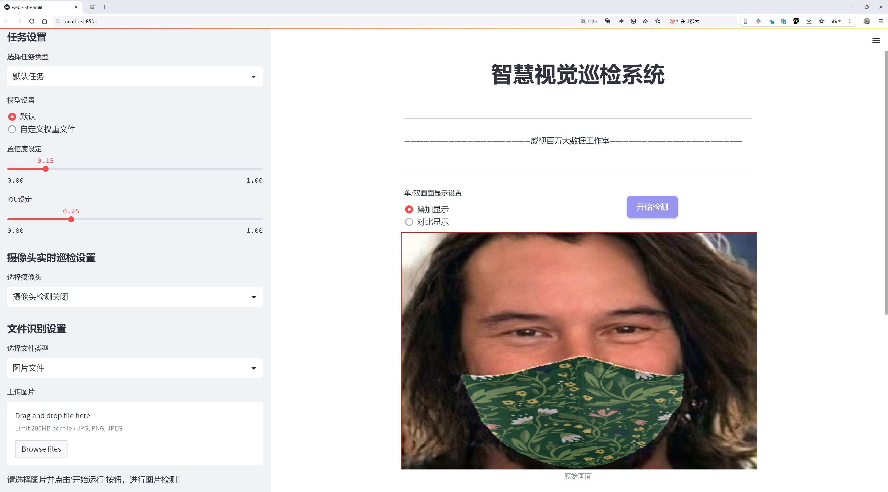
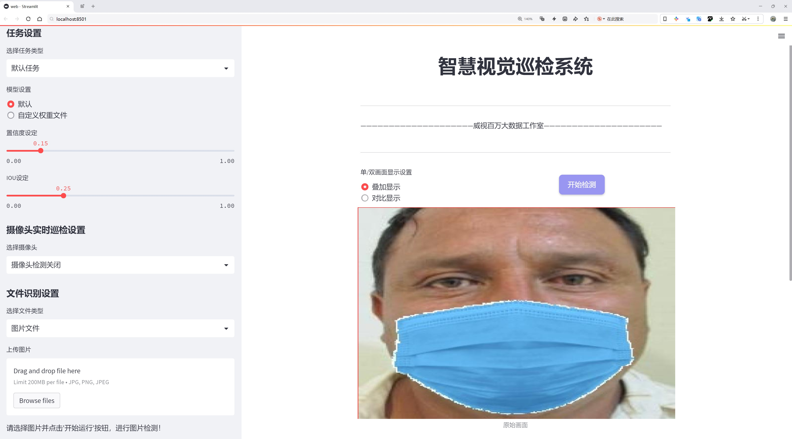
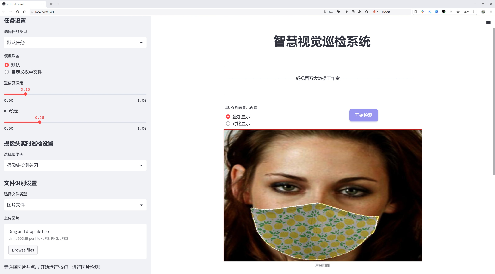
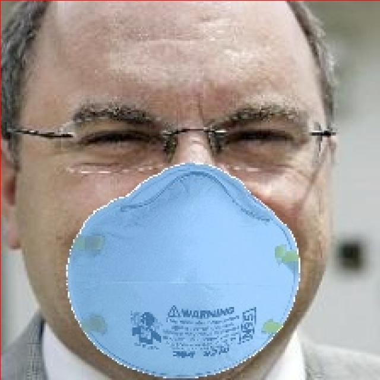
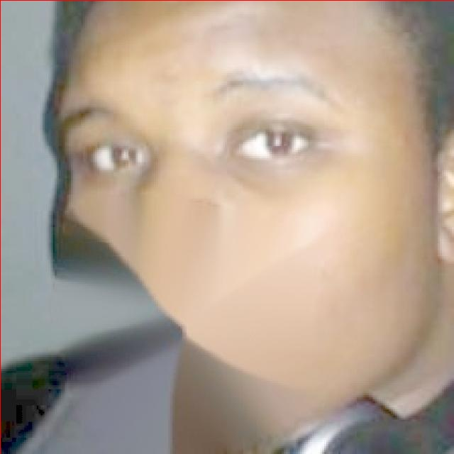
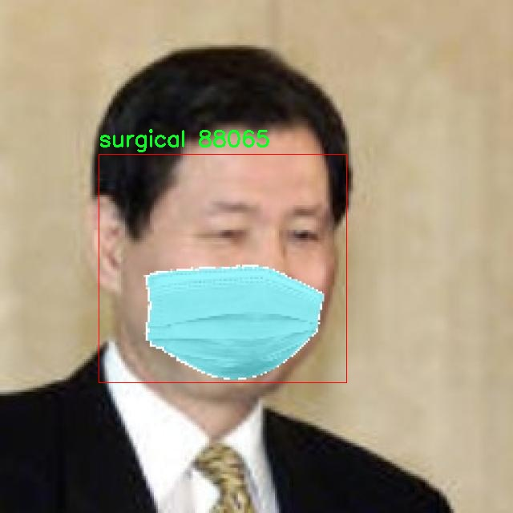
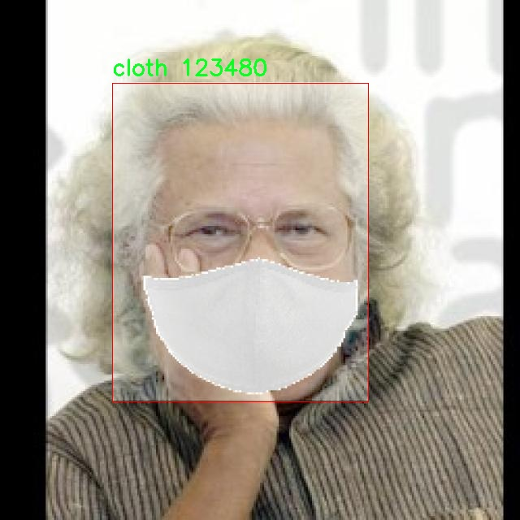

# 口罩类型和佩戴正确性检测检测系统源码分享
 # [一条龙教学YOLOV8标注好的数据集一键训练_70+全套改进创新点发刊_Web前端展示]

### 1.研究背景与意义

项目参考[AAAI Association for the Advancement of Artificial Intelligence](https://gitee.com/qunshansj/projects)

项目来源[AACV Association for the Advancement of Computer Vision](https://gitee.com/qunmasj/projects)

研究背景与意义

随着全球疫情的持续发展，口罩作为一种重要的个人防护装备，已成为人们日常生活中不可或缺的一部分。口罩的正确佩戴不仅能够有效降低病毒传播的风险，还能保护佩戴者免受空气中有害物质的侵害。因此，开发一种高效、准确的口罩类型和佩戴正确性检测系统显得尤为重要。近年来，计算机视觉和深度学习技术的迅猛发展为这一需求提供了新的解决方案。YOLO（You Only Look Once）系列模型因其高效的实时目标检测能力，已广泛应用于各种视觉识别任务中。YOLOv8作为该系列的最新版本，具备更强的特征提取能力和更快的推理速度，为口罩检测提供了良好的技术基础。

在本研究中，我们基于改进的YOLOv8模型，构建了一个专门针对口罩类型及佩戴正确性进行检测的系统。该系统的核心在于利用收集到的1600张图像数据，这些图像涵盖了13个类别，包括不同类型的口罩（如KN95、N95、外科口罩等）以及佩戴状态（如正确佩戴、错误佩戴、佩戴与不佩戴等）。这些类别的多样性不仅丰富了数据集的内容，也为模型的训练提供了充分的样本支持，确保了检测系统的准确性和鲁棒性。

本研究的意义在于，通过改进YOLOv8模型，提升口罩检测的精度和效率，从而为公共卫生安全提供技术支持。首先，准确识别口罩类型有助于提升公众对不同口罩防护效果的认知，促进科学佩戴口罩的行为。其次，检测佩戴正确性可以及时发现并纠正不当佩戴行为，降低病毒传播风险，尤其是在人员密集的公共场所。此外，该系统的应用不仅限于疫情期间，在日常生活中，随着空气污染和过敏原的增加，口罩的使用也日益普遍。因此，建立一个高效的口罩检测系统具有广泛的社会应用价值。

此外，本研究还将为后续的研究提供基础数据和方法论支持。通过对YOLOv8模型的改进和优化，研究者可以在其他领域的目标检测任务中借鉴其思路，推动计算机视觉技术的进一步发展。尤其是在实时监控、智能安防等领域，快速、准确的目标检测系统将大大提升工作效率和安全性。

综上所述，基于改进YOLOv8的口罩类型和佩戴正确性检测系统的研究，不仅具有重要的现实意义，也为相关领域的技术进步提供了新的视角和思路。通过该系统的开发与应用，我们期望能够为公众健康安全贡献一份力量，同时推动深度学习技术在实际应用中的进一步探索与发展。

### 2.图片演示







##### 注意：由于此博客编辑较早，上面“2.图片演示”和“3.视频演示”展示的系统图片或者视频可能为老版本，新版本在老版本的基础上升级如下：（实际效果以升级的新版本为准）

  （1）适配了YOLOV8的“目标检测”模型和“实例分割”模型，通过加载相应的权重（.pt）文件即可自适应加载模型。

  （2）支持“图片识别”、“视频识别”、“摄像头实时识别”三种识别模式。

  （3）支持“图片识别”、“视频识别”、“摄像头实时识别”三种识别结果保存导出，解决手动导出（容易卡顿出现爆内存）存在的问题，识别完自动保存结果并导出到tempDir中。

  （4）支持Web前端系统中的标题、背景图等自定义修改，后面提供修改教程。

  另外本项目提供训练的数据集和训练教程,暂不提供权重文件（best.pt）,需要您按照教程进行训练后实现图片演示和Web前端界面演示的效果。

### 3.视频演示

[3.1 视频演示](https://www.bilibili.com/video/BV13Lpje7EeB/)

### 4.数据集信息展示

##### 4.1 本项目数据集详细数据（类别数＆类别名）

nc: 13
names: ['angry', 'cloth', 'happy', 'kn95', 'mask', 'mask_weared_incorrect', 'n95', 'neutral', 'sad', 'surgical', 'surprised', 'with_mask', 'without_mask']


##### 4.2 本项目数据集信息介绍

数据集信息展示

在当前全球公共卫生形势下，口罩的佩戴与类型的正确识别显得尤为重要。为此，我们构建了一个名为“123”的数据集，旨在为改进YOLOv8的口罩类型和佩戴正确性检测系统提供坚实的数据基础。该数据集包含13个类别，涵盖了多种情绪状态与口罩类型，具体类别包括：愤怒（angry）、布口罩（cloth）、快乐（happy）、KN95口罩（kn95）、普通口罩（mask）、佩戴不当的口罩（mask_weared_incorrect）、N95口罩（n95）、中性表情（neutral）、悲伤（sad）、外科口罩（surgical）、惊讶（surprised）、佩戴口罩（with_mask）以及不佩戴口罩（without_mask）。

数据集的设计旨在捕捉不同情绪状态下的个体与口罩的多样性，尤其是在疫情期间，情绪与口罩佩戴的关系愈发受到关注。每个类别不仅代表了不同的口罩类型，还反映了个体在佩戴口罩时的情绪状态。这种多维度的分类使得数据集在训练深度学习模型时，能够更全面地考虑到影响口罩佩戴正确性的多种因素。

在数据收集过程中，我们采用了多种渠道，包括社交媒体、公共场所监控视频以及实验室拍摄等方式，确保数据的多样性和真实性。每个类别的数据量均衡，保证了模型训练时的有效性和准确性。我们特别关注了佩戴不当的口罩这一类别，旨在提高模型对不规范佩戴行为的识别能力，以便在实际应用中能够及时发出警示，促进公众的健康意识。

此外，数据集中每张图像都附带了详细的标注信息，包括口罩类型、佩戴状态以及个体的情绪表情。这些信息不仅为模型的训练提供了丰富的上下文，也为后续的分析与研究提供了便利。通过这种精细化的标注，我们希望能够提升YOLOv8在复杂场景下的检测能力，使其在真实世界中能够更准确地识别不同类型的口罩及其佩戴状态。

在模型训练阶段，我们将采用数据增强技术，以提高模型的泛化能力。这包括图像旋转、缩放、裁剪以及颜色调整等操作，旨在模拟各种可能的佩戴场景，从而使模型能够适应不同的环境与条件。通过对“123”数据集的深入分析与训练，我们期望能够显著提升YOLOv8在口罩检测任务中的性能，进而为公共卫生安全贡献一份力量。

总之，数据集“123”不仅为口罩类型和佩戴正确性检测提供了丰富的样本和标注信息，也为研究人员和开发者提供了一个良好的基础，以推动相关技术的进步与应用。随着对该数据集的不断深入研究，我们相信其在实际应用中的潜力将不断被挖掘，为实现更安全的公共环境做出积极贡献。










### 5.全套项目环境部署视频教程（零基础手把手教学）

[5.1 环境部署教程链接（零基础手把手教学）](https://www.ixigua.com/7404473917358506534?logTag=c807d0cbc21c0ef59de5)


[5.2 安装Python虚拟环境创建和依赖库安装视频教程链接（零基础手把手教学）](https://www.ixigua.com/7404474678003106304?logTag=1f1041108cd1f708b01a)

### 6.手把手YOLOV8训练视频教程（零基础小白有手就能学会）

[6.1 手把手YOLOV8训练视频教程（零基础小白有手就能学会）](https://www.ixigua.com/7404477157818401292?logTag=d31a2dfd1983c9668658)

### 7.70+种全套YOLOV8创新点代码加载调参视频教程（一键加载写好的改进模型的配置文件）

[7.1 70+种全套YOLOV8创新点代码加载调参视频教程（一键加载写好的改进模型的配置文件）](https://www.ixigua.com/7404478314661806627?logTag=29066f8288e3f4eea3a4)

### 8.70+种全套YOLOV8创新点原理讲解（非科班也可以轻松写刊发刊，V10版本正在科研待更新）

由于篇幅限制，每个创新点的具体原理讲解就不一一展开，具体见下列网址中的创新点对应子项目的技术原理博客网址【Blog】：


[8.1 70+种全套YOLOV8创新点原理讲解链接](https://gitee.com/qunmasj/good)

### 9.系统功能展示（检测对象为举例，实际内容以本项目数据集为准）

图9.1.系统支持检测结果表格显示

  图9.2.系统支持置信度和IOU阈值手动调节

  图9.3.系统支持自定义加载权重文件best.pt(需要你通过步骤5中训练获得)

  图9.4.系统支持摄像头实时识别

  图9.5.系统支持图片识别

  图9.6.系统支持视频识别

  图9.7.系统支持识别结果文件自动保存

  图9.8.系统支持Excel导出检测结果数据


### 10.原始YOLOV8算法原理

原始YOLOv8算法原理

YOLOv8是计算机视觉领域的一项重要突破，于2023年1月10日正式推出。作为YOLO系列的最新版本，YOLOv8在目标检测、实例分割和图像分类等任务中展现出卓越的性能，超越了前代模型的多项指标，成为当前最先进的实时目标检测模型之一。其设计理念和架构不仅继承了YOLOv5、YOLOv6和YOLOX等前辈的优点，还在此基础上进行了全面的优化和创新，确保了在精度和执行速度上的双重提升。

YOLOv8的核心在于其全新的骨干网络设计和检测头架构。相较于YOLOv5，YOLOv8将第一个卷积层的卷积核大小从6x6缩小至3x3，这一变化显著提高了特征提取的细腻度，使得模型能够更好地捕捉到图像中的细节信息。此外，YOLOv8在骨干网络中采用了CSP（Cross Stage Partial）结构，优化了C3模块，替换为更轻量化的C2f模块。这一新模块通过增加跳层连接和Split操作，增强了信息流动的效率，确保了模型在保持轻量化的同时，依然能够获取丰富的梯度信息。

在特征融合方面，YOLOv8依然采用了PAN-FPN（Path Aggregation Network - Feature Pyramid Network）结构，但在上采样阶段去掉了卷积层，这一简化使得特征融合过程更加高效。通过这种方式，YOLOv8能够更好地利用不同尺度的特征图，从而提升小目标的检测能力。尤其是在高分辨率图像处理上，YOLOv8表现出了更强的适应性，能够有效地识别出图像中的细小目标。

YOLOv8的检测头部分是其最大的创新之一。该模型摒弃了传统的Anchor-Based检测方式，转而采用Anchor-Free的解耦合检测头结构。这一转变不仅简化了模型的设计，还提高了检测的灵活性和准确性。YOLOv8的检测头分为分类和回归两个独立的分支，消除了之前的objectness分支，使得模型在进行目标分类和定位时能够更加专注，减少了信息的干扰。

在损失函数的设计上，YOLOv8引入了新的损失策略，采用变焦损失来计算分类损失，并使用数据平均保真度损失和完美交并比损失来优化边界框的回归损失。这种新颖的损失计算方式使得模型在训练过程中能够更好地平衡分类精度和定位精度，从而在各种场景下都能保持优异的表现。

为了适应不同的应用场景，YOLOv8提供了多种规模的模型，包括n、s、m、l、x五种不同的版本。每种模型在深度、特征图宽度和缩放系数上都有所不同，以便于用户根据具体需求选择最合适的模型。通过这种灵活的设计，YOLOv8能够在从CPU到GPU的各种硬件平台上高效运行，展现出良好的通用性和适应性。

总的来说，YOLOv8在目标检测领域的成功，得益于其在网络结构、特征提取、损失计算等多个方面的创新与优化。通过融合多种先进技术，YOLOv8不仅提高了目标检测的精度和速度，还在实际应用中展现出极高的灵活性和适应性。无论是在复杂的场景中进行实时目标检测，还是在高分辨率图像中识别小目标，YOLOv8都能提供令人满意的结果。这使得YOLOv8成为了当前计算机视觉领域中不可或缺的重要工具，为各类应用场景提供了强有力的支持。


### 11.项目核心源码讲解（再也不用担心看不懂代码逻辑）

#### 11.1 70+种YOLOv8算法改进源码大全和调试加载训练教程（非必要）\ultralytics\utils\__init__.py

以下是经过精简和注释的核心代码部分，主要保留了功能和结构，去掉了冗余的部分。

```python
import os
import platform
import logging
from pathlib import Path
import yaml
import torch

# 定义一些常量
ROOT = Path(__file__).resolve().parents[1]  # 获取项目根目录
DEFAULT_CFG_PATH = ROOT / 'cfg/default.yaml'  # 默认配置文件路径

# 设置日志
def set_logging(name='ultralytics', verbose=True):
    """设置日志记录配置"""
    level = logging.INFO if verbose else logging.ERROR
    logging.basicConfig(level=level, format='%(message)s')
    return logging.getLogger(name)

# 加载YAML配置文件
def yaml_load(file='data.yaml'):
    """从YAML文件加载数据"""
    with open(file, 'r', encoding='utf-8') as f:
        return yaml.safe_load(f) or {}

# 保存YAML数据到文件
def yaml_save(file='data.yaml', data=None):
    """将数据保存为YAML格式"""
    with open(file, 'w', encoding='utf-8') as f:
        yaml.safe_dump(data, f, sort_keys=False)

# 检查当前操作系统
def is_ubuntu() -> bool:
    """检查当前操作系统是否为Ubuntu"""
    return platform.system() == 'Linux' and 'ubuntu' in platform.version().lower()

# 检查是否在Colab环境中
def is_colab() -> bool:
    """检查当前脚本是否在Google Colab中运行"""
    return 'COLAB_RELEASE_TAG' in os.environ

# 检查是否在Kaggle环境中
def is_kaggle() -> bool:
    """检查当前脚本是否在Kaggle内核中运行"""
    return os.environ.get('PWD') == '/kaggle/working'

# 获取用户配置目录
def get_user_config_dir(sub_dir='Ultralytics'):
    """获取用户配置目录"""
    if platform.system() == 'Windows':
        path = Path.home() / 'AppData' / 'Roaming' / sub_dir
    elif platform.system() == 'Darwin':  # macOS
        path = Path.home() / 'Library' / 'Application Support' / sub_dir
    else:  # Linux
        path = Path.home() / '.config' / sub_dir

    path.mkdir(parents=True, exist_ok=True)  # 创建目录
    return path

# 默认配置加载
DEFAULT_CFG_DICT = yaml_load(DEFAULT_CFG_PATH)
DEFAULT_CFG = {k: v for k, v in DEFAULT_CFG_DICT.items() if isinstance(v, (str, int, float, bool))}

# 设置日志记录
LOGGER = set_logging(verbose=True)

# 检查网络连接
def is_online() -> bool:
    """检查网络连接"""
    import socket
    try:
        socket.create_connection(("1.1.1.1", 53), timeout=2)
        return True
    except OSError:
        return False

# 运行时检查
ONLINE = is_online()
```

### 代码注释说明：
1. **常量定义**：定义了项目根目录和默认配置文件路径。
2. **日志设置**：`set_logging`函数用于配置日志记录，方便调试和信息输出。
3. **YAML文件操作**：`yaml_load`和`yaml_save`函数用于加载和保存YAML格式的数据，便于配置管理。
4. **环境检查**：提供了检查当前操作系统和运行环境的函数，如`is_ubuntu`、`is_colab`和`is_kaggle`。
5. **用户配置目录**：`get_user_config_dir`函数用于获取用户的配置目录，确保应用程序的可配置性。
6. **默认配置加载**：从YAML文件加载默认配置，并将其存储为字典格式。
7. **网络连接检查**：`is_online`函数用于检查当前的网络连接状态。

以上代码保留了项目的核心功能，并进行了详细的中文注释，便于理解和维护。

这个文件是Ultralytics YOLO（You Only Look Once）算法的一个重要模块，主要用于初始化和配置一些实用工具。文件中包含了许多导入的库和模块，这些库和模块为YOLO算法的实现提供了基础功能。

首先，文件中定义了一些常量，例如`RANK`和`LOCAL_RANK`，用于多GPU训练的分布式设置。`FILE`和`ROOT`变量用于获取当前文件的路径和项目的根目录，`ASSETS`用于指定默认的图像存储位置。`DEFAULT_CFG_PATH`指向默认的配置文件，`NUM_THREADS`则根据CPU核心数设置了YOLOv5的多线程处理数量。

接下来，文件中定义了一些环境变量和全局设置，比如`AUTOINSTALL`和`VERBOSE`，它们用于控制自动安装和详细输出模式。`TQDM_BAR_FORMAT`用于设置进度条的格式，`LOGGING_NAME`用于指定日志记录的名称。

文件中还包含了许多实用的类和函数。例如，`TQDM`类是对原始`tqdm`库的一个自定义扩展，提供了不同的默认参数。`SimpleClass`和`IterableSimpleNamespace`类则用于简化对象的字符串表示和属性访问，方便调试和使用。

在图形绘制方面，`plt_settings`函数是一个装饰器，用于临时设置matplotlib的参数和后端。`set_logging`函数用于配置日志记录，确保在多GPU训练时正确设置日志级别。

文件中还定义了一些用于检查运行环境的函数，比如`is_ubuntu`、`is_colab`、`is_kaggle`等，这些函数可以帮助判断当前脚本的运行环境，以便进行相应的配置。

此外，文件中还包含了对YAML文件的读写操作的函数，如`yaml_save`和`yaml_load`，这些函数用于保存和加载配置数据。`SettingsManager`类则用于管理Ultralytics的设置，提供了加载、保存和更新设置的功能。

最后，文件还实现了一些用于错误处理和线程安全的功能，例如`TryExcept`类和`ThreadingLocked`类。这些功能可以帮助在多线程环境中安全地执行函数，并在出现错误时提供友好的错误信息。

总的来说，这个文件为YOLO算法的实现提供了丰富的工具和功能，确保了代码的可读性、可维护性和可扩展性。

#### 11.2 ui.py

```python
import sys
import subprocess

def run_script(script_path):
    """
    使用当前 Python 环境运行指定的脚本。

    Args:
        script_path (str): 要运行的脚本路径

    Returns:
        None
    """
    # 获取当前 Python 解释器的路径
    python_path = sys.executable

    # 构建运行命令，使用 streamlit 运行指定的脚本
    command = f'"{python_path}" -m streamlit run "{script_path}"'

    # 执行命令
    result = subprocess.run(command, shell=True)
    # 检查命令执行结果，如果返回码不为0，则表示出错
    if result.returncode != 0:
        print("脚本运行出错。")

# 主程序入口
if __name__ == "__main__":
    # 指定要运行的脚本路径
    script_path = "web.py"  # 这里可以直接指定脚本名，假设在当前目录下

    # 调用函数运行脚本
    run_script(script_path)
```

### 代码核心部分及注释说明：

1. **导入模块**：
   - `import sys`: 导入 sys 模块以获取当前 Python 解释器的路径。
   - `import subprocess`: 导入 subprocess 模块以执行外部命令。

2. **定义 `run_script` 函数**：
   - 该函数接受一个参数 `script_path`，表示要运行的 Python 脚本的路径。
   - 使用 `sys.executable` 获取当前 Python 解释器的路径。
   - 构建一个命令字符串，使用 `streamlit` 模块运行指定的脚本。
   - 使用 `subprocess.run` 执行构建的命令，并检查返回码以判断脚本是否成功运行。

3. **主程序入口**：
   - 使用 `if __name__ == "__main__":` 确保只有在直接运行该脚本时才会执行以下代码。
   - 指定要运行的脚本路径（这里假设脚本在当前目录下）。
   - 调用 `run_script` 函数来执行指定的脚本。

这个程序文件的主要功能是使用当前的 Python 环境来运行一个指定的脚本，具体是通过 Streamlit 框架来启动一个 Web 应用。首先，程序导入了必要的模块，包括 `sys`、`os` 和 `subprocess`，这些模块提供了与系统交互的功能。特别是 `subprocess` 模块允许程序创建新的进程、连接到它们的输入/输出/错误管道，并获取它们的返回码。

接下来，定义了一个名为 `run_script` 的函数，该函数接受一个参数 `script_path`，表示要运行的脚本的路径。在函数内部，首先获取当前 Python 解释器的路径，这通过 `sys.executable` 实现。然后，构建一个命令字符串，使用 Streamlit 来运行指定的脚本。命令的格式是 `"{python_path}" -m streamlit run "{script_path}"`，其中 `python_path` 是当前 Python 解释器的路径，`script_path` 是要运行的脚本路径。

之后，使用 `subprocess.run` 方法执行构建好的命令。这个方法会在新的 shell 中运行命令，并等待命令执行完成。执行完成后，检查返回码，如果返回码不为 0，表示脚本运行出错，程序会打印出错误信息。

在文件的最后部分，使用 `if __name__ == "__main__":` 语句来确保只有在直接运行该文件时才会执行下面的代码。这里指定了要运行的脚本路径为 `web.py`，并调用 `run_script` 函数来执行这个脚本。

总的来说，这个程序文件提供了一种简便的方式来启动一个 Streamlit Web 应用，通过指定脚本路径并使用当前的 Python 环境来运行它。

#### 11.3 code\ultralytics\utils\callbacks\comet.py

以下是代码中最核心的部分，并附上详细的中文注释：

```python
# 导入必要的库
from ultralytics.utils import LOGGER, RANK, SETTINGS, TESTS_RUNNING, ops
import os
from pathlib import Path

# 定义支持的任务类型
COMET_SUPPORTED_TASKS = ["detect"]

# 定义评估和标签绘图的名称
EVALUATION_PLOT_NAMES = "F1_curve", "P_curve", "R_curve", "PR_curve", "confusion_matrix"
LABEL_PLOT_NAMES = "labels", "labels_correlogram"

# 初始化图像预测计数
_comet_image_prediction_count = 0

def _get_comet_mode():
    """获取环境变量中设置的Comet模式，默认为'online'。"""
    return os.getenv("COMET_MODE", "online")

def _create_experiment(args):
    """创建Comet实验对象，仅在分布式训练的主进程中创建。"""
    if RANK not in (-1, 0):  # 仅在主进程中执行
        return
    try:
        comet_mode = _get_comet_mode()  # 获取Comet模式
        _project_name = os.getenv("COMET_PROJECT_NAME", args.project)  # 获取项目名称
        experiment = comet_ml.Experiment(project_name=_project_name) if comet_mode != "offline" else comet_ml.OfflineExperiment(project_name=_project_name)
        experiment.log_parameters(vars(args))  # 记录参数
        # 记录其他设置
        experiment.log_others({
            "eval_batch_logging_interval": _get_eval_batch_logging_interval(),
            "log_confusion_matrix_on_eval": _should_log_confusion_matrix(),
            "log_image_predictions": _should_log_image_predictions(),
            "max_image_predictions": _get_max_image_predictions_to_log(),
        })
        experiment.log_other("Created from", "yolov8")  # 记录创建来源
    except Exception as e:
        LOGGER.warning(f"WARNING ⚠️ Comet installed but not initialized correctly, not logging this run. {e}")

def on_train_epoch_end(trainer):
    """在每个训练周期结束时记录指标和保存批次图像。"""
    experiment = comet_ml.get_global_experiment()  # 获取当前的Comet实验
    if not experiment:
        return

    metadata = _fetch_trainer_metadata(trainer)  # 获取训练元数据
    curr_epoch = metadata["curr_epoch"]  # 当前周期
    curr_step = metadata["curr_step"]  # 当前步骤

    # 记录训练损失指标
    experiment.log_metrics(trainer.label_loss_items(trainer.tloss, prefix="train"), step=curr_step, epoch=curr_epoch)

    # 在第一个周期结束时记录训练批次图像
    if curr_epoch == 1:
        _log_images(experiment, trainer.save_dir.glob("train_batch*.jpg"), curr_step)

def on_train_end(trainer):
    """在训练结束时执行操作。"""
    experiment = comet_ml.get_global_experiment()  # 获取当前的Comet实验
    if not experiment:
        return

    metadata = _fetch_trainer_metadata(trainer)  # 获取训练元数据
    curr_epoch = metadata["curr_epoch"]  # 当前周期
    curr_step = metadata["curr_step"]  # 当前步骤

    _log_model(experiment, trainer)  # 记录最佳训练模型
    if _should_log_confusion_matrix():  # 如果需要记录混淆矩阵
        _log_confusion_matrix(experiment, trainer, curr_step, curr_epoch)
    if _should_log_image_predictions():  # 如果需要记录图像预测
        _log_image_predictions(experiment, trainer.validator, curr_step)
    
    experiment.end()  # 结束实验

# 定义回调函数
callbacks = {
    "on_train_epoch_end": on_train_epoch_end,
    "on_train_end": on_train_end,
} if comet_ml else {}
```

### 代码说明：
1. **导入模块**：导入必要的库和模块，包括`ultralytics`的工具和`os`、`pathlib`等标准库。
2. **全局变量**：定义了一些全局变量，如支持的任务类型、评估绘图名称和图像预测计数。
3. **获取Comet模式**：定义了一个函数来获取当前的Comet模式，默认为“online”。
4. **创建实验**：在`_create_experiment`函数中，创建Comet实验对象并记录相关参数和设置，确保仅在主进程中执行。
5. **训练周期结束时的操作**：在`on_train_epoch_end`和`on_train_end`函数中，记录训练指标、保存图像和模型，并在训练结束时结束Comet实验。
6. **回调函数**：定义了在训练过程中调用的回调函数，以便在特定事件发生时执行相应的操作。

这个程序文件是用于与Comet.ml集成的YOLOv8训练回调函数的实现。它主要负责在训练过程中记录各种信息和指标，以便后续分析和可视化。文件中首先导入了一些必要的模块和库，并进行了初步的设置和检查，以确保Comet.ml的集成是启用的。

文件中定义了一系列辅助函数，这些函数的功能包括获取环境变量中的配置、处理图像预测的标注、格式化真实标签和预测标签、记录混淆矩阵、记录图像及其注释等。其中，许多函数会根据环境变量的设置来决定是否执行特定的记录操作，例如是否记录混淆矩阵、图像预测等。

在训练的不同阶段，文件定义了一些回调函数，例如在预训练开始时创建或恢复Comet实验、在每个训练周期结束时记录指标和保存图像、在每个拟合周期结束时记录模型资产等。这些回调函数会在训练过程中被自动调用，以确保相关数据能够及时记录到Comet.ml中。

此外，文件中还定义了一些用于处理和格式化数据的函数，例如将YOLOv8的预测框调整为原始图像的形状、创建预测元数据映射等。这些函数确保了记录到Comet.ml的数据是准确和有用的。

最后，文件通过一个字典将所有的回调函数组织在一起，以便在Comet.ml可用时进行调用。这种结构使得代码的可读性和可维护性得到了提升，同时也方便了未来的扩展和修改。整体来看，这个文件的主要目的是为YOLOv8模型的训练过程提供全面的监控和记录功能，以便于开发者分析模型的性能和训练过程中的各种指标。

#### 11.4 code\ultralytics\solutions\__init__.py

```python
# Ultralytics YOLO 🚀, AGPL-3.0 license

# 这段代码是Ultralytics YOLO（You Only Look Once）模型的开源实现，遵循AGPL-3.0许可证。
# YOLO是一种实时目标检测系统，能够在图像中快速识别和定位多个对象。

# 核心部分通常包括模型的定义、训练和推理过程。以下是YOLO模型的简化核心代码示例：

import torch  # 导入PyTorch库，用于深度学习模型的构建和训练

class YOLOv5(torch.nn.Module):  # 定义YOLOv5模型类，继承自PyTorch的Module类
    def __init__(self, num_classes):  # 初始化方法，接收类别数量作为参数
        super(YOLOv5, self).__init__()  # 调用父类的初始化方法
        self.num_classes = num_classes  # 设置模型的类别数量
        # 这里可以添加模型的层，例如卷积层、激活函数等

    def forward(self, x):  # 定义前向传播方法
        # 在这里实现模型的前向传播逻辑
        # 例如：通过卷积层处理输入数据，生成特征图
        return x  # 返回处理后的结果

# 实例化模型
model = YOLOv5(num_classes=80)  # 创建YOLOv5模型实例，假设有80个类别

# 模型推理示例
input_tensor = torch.randn(1, 3, 640, 640)  # 创建一个随机输入张量，模拟一张640x640的RGB图像
output = model(input_tensor)  # 将输入张量传入模型，获取输出结果

# 输出结果包含目标检测的边界框、类别和置信度等信息
```

### 注释说明：
1. **导入库**：使用`import torch`导入PyTorch库，这是实现深度学习模型的基础。
2. **模型类定义**：`YOLOv5`类继承自`torch.nn.Module`，是构建深度学习模型的标准方式。
3. **初始化方法**：`__init__`方法用于设置模型的基本参数，如类别数量，并可以定义模型的各个层。
4. **前向传播方法**：`forward`方法实现了数据如何通过模型进行处理的逻辑。
5. **模型实例化**：创建YOLOv5模型实例，指定检测的类别数量。
6. **模型推理**：生成一个随机输入张量并通过模型进行推理，得到输出结果。输出通常包含目标检测的相关信息。

这段代码展示了YOLO模型的基本结构和工作流程，核心在于模型的定义和推理过程。

这个程序文件的文件名是 `__init__.py`，位于 `code\ultralytics\solutions` 目录下。根据文件的注释内容，可以看出这个文件与 Ultralytics YOLO（You Only Look Once）相关，这是一个广泛使用的目标检测模型。文件开头的注释表明该项目遵循 AGPL-3.0 许可证，这是一种开源许可证，允许用户自由使用、修改和分发软件，但要求任何分发的修改版本也必须开源。

在 Python 中，`__init__.py` 文件的存在通常表示该目录是一个包，可以被导入。这个文件可能用于初始化包的内容，定义包的公共接口，或者执行一些初始化代码。虽然在这个特定的代码片段中没有提供具体的实现细节，但可以推测，`__init__.py` 文件可能会包含一些与 YOLO 目标检测相关的功能、类或方法的导入。

总的来说，这个文件是 Ultralytics YOLO 项目的一部分，负责包的初始化和管理，确保该项目的模块能够被正确导入和使用。

#### 11.5 train.py

以下是经过简化和注释的核心代码部分：

```python
import random
import numpy as np
import torch.nn as nn
from ultralytics.data import build_dataloader, build_yolo_dataset
from ultralytics.engine.trainer import BaseTrainer
from ultralytics.models import yolo
from ultralytics.nn.tasks import DetectionModel
from ultralytics.utils import LOGGER, RANK
from ultralytics.utils.torch_utils import de_parallel, torch_distributed_zero_first

class DetectionTrainer(BaseTrainer):
    """
    扩展自 BaseTrainer 类，用于基于检测模型的训练。
    """

    def build_dataset(self, img_path, mode="train", batch=None):
        """
        构建 YOLO 数据集。

        参数:
            img_path (str): 包含图像的文件夹路径。
            mode (str): 模式，`train` 或 `val`，用户可以为每种模式自定义不同的增强。
            batch (int, optional): 批次大小，仅用于 `rect` 模式。默认为 None。
        """
        gs = max(int(de_parallel(self.model).stride.max() if self.model else 0), 32)  # 获取模型的最大步幅
        return build_yolo_dataset(self.args, img_path, batch, self.data, mode=mode, rect=mode == "val", stride=gs)

    def get_dataloader(self, dataset_path, batch_size=16, rank=0, mode="train"):
        """构造并返回数据加载器。"""
        assert mode in ["train", "val"]  # 确保模式有效
        with torch_distributed_zero_first(rank):  # 仅在 DDP 时初始化数据集 *.cache 一次
            dataset = self.build_dataset(dataset_path, mode, batch_size)  # 构建数据集
        shuffle = mode == "train"  # 训练模式下打乱数据
        workers = self.args.workers if mode == "train" else self.args.workers * 2  # 设置工作线程数
        return build_dataloader(dataset, batch_size, workers, shuffle, rank)  # 返回数据加载器

    def preprocess_batch(self, batch):
        """对图像批次进行预处理，包括缩放和转换为浮点数。"""
        batch["img"] = batch["img"].to(self.device, non_blocking=True).float() / 255  # 将图像转换为浮点数并归一化
        if self.args.multi_scale:  # 如果启用多尺度
            imgs = batch["img"]
            sz = (
                random.randrange(self.args.imgsz * 0.5, self.args.imgsz * 1.5 + self.stride)
                // self.stride
                * self.stride
            )  # 随机选择新的图像大小
            sf = sz / max(imgs.shape[2:])  # 计算缩放因子
            if sf != 1:  # 如果需要缩放
                ns = [
                    math.ceil(x * sf / self.stride) * self.stride for x in imgs.shape[2:]
                ]  # 计算新的形状
                imgs = nn.functional.interpolate(imgs, size=ns, mode="bilinear", align_corners=False)  # 进行插值缩放
            batch["img"] = imgs  # 更新批次图像
        return batch

    def get_model(self, cfg=None, weights=None, verbose=True):
        """返回 YOLO 检测模型。"""
        model = DetectionModel(cfg, nc=self.data["nc"], verbose=verbose and RANK == -1)  # 创建检测模型
        if weights:
            model.load(weights)  # 加载权重
        return model

    def plot_training_samples(self, batch, ni):
        """绘制带有注释的训练样本。"""
        plot_images(
            images=batch["img"],
            batch_idx=batch["batch_idx"],
            cls=batch["cls"].squeeze(-1),
            bboxes=batch["bboxes"],
            paths=batch["im_file"],
            fname=self.save_dir / f"train_batch{ni}.jpg",
            on_plot=self.on_plot,
        )

    def plot_metrics(self):
        """从 CSV 文件绘制指标。"""
        plot_results(file=self.csv, on_plot=self.on_plot)  # 保存结果图
```

### 代码注释说明：
1. **类定义**：`DetectionTrainer` 类继承自 `BaseTrainer`，用于训练检测模型。
2. **构建数据集**：`build_dataset` 方法用于构建 YOLO 数据集，支持训练和验证模式。
3. **获取数据加载器**：`get_dataloader` 方法构造数据加载器，确保在分布式训练中只初始化一次数据集。
4. **预处理批次**：`preprocess_batch` 方法对输入图像进行归一化和缩放处理，支持多尺度训练。
5. **获取模型**：`get_model` 方法返回一个 YOLO 检测模型，并可选择加载预训练权重。
6. **绘制训练样本**：`plot_training_samples` 方法用于可视化训练样本及其注释。
7. **绘制指标**：`plot_metrics` 方法用于从 CSV 文件中绘制训练过程中的指标。

这些核心部分和注释可以帮助理解代码的主要功能和结构。

这个程序文件 `train.py` 是一个用于训练目标检测模型的脚本，特别是基于 YOLO（You Only Look Once）模型的实现。它继承自 `BaseTrainer` 类，提供了一系列方法来构建数据集、加载数据、预处理图像、设置模型属性、获取模型、验证模型、记录损失、绘制训练样本和绘制训练指标等功能。

首先，文件中导入了一些必要的库和模块，包括数学运算、随机数生成、深度学习相关的 PyTorch 库，以及 YOLO 模型和数据处理的工具。接着，定义了 `DetectionTrainer` 类，这个类主要负责训练过程中的各个环节。

在 `build_dataset` 方法中，程序根据传入的图像路径和模式（训练或验证）构建 YOLO 数据集。这个方法允许用户为不同的模式自定义数据增强策略。它还计算了模型的步幅（stride），以确保输入图像的尺寸与模型的要求相匹配。

`get_dataloader` 方法用于构建并返回数据加载器。它会根据训练或验证模式的不同，设置数据集的加载方式，并处理多进程数据加载的相关参数。

`preprocess_batch` 方法负责对图像批次进行预处理，包括将图像缩放到适当的大小并转换为浮点数格式。它还支持多尺度训练，通过随机选择图像的尺寸来增强模型的鲁棒性。

`set_model_attributes` 方法用于设置模型的属性，包括类别数量和类别名称等。这些属性是训练过程中非常重要的，因为它们直接影响模型的学习效果。

`get_model` 方法返回一个 YOLO 检测模型，并可以加载预训练的权重。这个方法是训练过程中的关键，因为它初始化了要训练的模型。

`get_validator` 方法返回一个用于验证模型性能的验证器。它会记录训练过程中的损失，包括边界框损失、类别损失和分布损失等。

`label_loss_items` 方法用于返回带有标签的训练损失项的字典，便于后续的损失记录和分析。

`progress_string` 方法返回一个格式化的字符串，显示训练进度，包括当前的 epoch、GPU 内存使用情况、损失值、实例数量和图像大小等信息。

`plot_training_samples` 方法用于绘制训练样本及其标注，以便于可视化训练过程中的数据。

最后，`plot_metrics` 和 `plot_training_labels` 方法分别用于绘制训练过程中的指标和标签，帮助用户更好地理解模型的训练效果和数据分布。

总体来说，这个程序文件提供了一个完整的框架，用于训练 YOLO 模型，涵盖了从数据准备到模型训练和验证的各个方面，适合用于目标检测任务。

#### 11.6 code\ultralytics\models\sam\predict.py

以下是代码中最核心的部分，并附上详细的中文注释：

```python
class Predictor(BasePredictor):
    """
    Predictor类用于Segment Anything Model (SAM)，继承自BasePredictor。

    该类提供了一个用于图像分割任务的模型推理接口。通过先进的架构和可提示的分割能力，它实现了灵活的实时掩膜生成。
    该类能够处理多种类型的提示，例如边界框、点和低分辨率掩膜。
    """

    def __init__(self, cfg=DEFAULT_CFG, overrides=None, _callbacks=None):
        """
        初始化Predictor，设置配置、覆盖和回调。

        Args:
            cfg (dict): 配置字典。
            overrides (dict, optional): 覆盖默认配置的值的字典。
            _callbacks (dict, optional): 自定义行为的回调函数字典。
        """
        if overrides is None:
            overrides = {}
        overrides.update(dict(task="segment", mode="predict", imgsz=1024))
        super().__init__(cfg, overrides, _callbacks)
        self.args.retina_masks = True  # 设置使用高分辨率掩膜
        self.im = None  # 输入图像
        self.features = None  # 提取的图像特征
        self.prompts = {}  # 存储提示信息
        self.segment_all = False  # 控制是否分割所有对象的标志

    def preprocess(self, im):
        """
        对输入图像进行预处理以进行模型推理。

        Args:
            im (torch.Tensor | List[np.ndarray]): BCHW格式的张量或HWC格式的numpy数组列表。

        Returns:
            (torch.Tensor): 预处理后的图像张量。
        """
        if self.im is not None:
            return self.im  # 如果已经处理过，直接返回
        not_tensor = not isinstance(im, torch.Tensor)
        if not_tensor:
            im = np.stack(self.pre_transform(im))  # 将图像转换为张量
            im = im[..., ::-1].transpose((0, 3, 1, 2))  # 转换通道顺序
            im = np.ascontiguousarray(im)
            im = torch.from_numpy(im)

        im = im.to(self.device)  # 将图像移动到指定设备
        im = im.half() if self.model.fp16 else im.float()  # 根据模型设置转换数据类型
        if not_tensor:
            im = (im - self.mean) / self.std  # 归一化处理
        return im

    def inference(self, im, bboxes=None, points=None, labels=None, masks=None, multimask_output=False, *args, **kwargs):
        """
        基于给定的输入提示执行图像分割推理。

        Args:
            im (torch.Tensor): 预处理后的输入图像张量，形状为(N, C, H, W)。
            bboxes (np.ndarray | List, optional): 边界框，形状为(N, 4)，XYXY格式。
            points (np.ndarray | List, optional): 指示对象位置的点，形状为(N, 2)，像素坐标。
            labels (np.ndarray | List, optional): 点提示的标签，形状为(N, )。1表示前景，0表示背景。
            masks (np.ndarray, optional): 先前预测的低分辨率掩膜，形状应为(N, H, W)，对于SAM，H=W=256。
            multimask_output (bool, optional): 返回多个掩膜的标志。对模糊提示有帮助。默认为False。

        Returns:
            (tuple): 包含以下三个元素的元组。
                - np.ndarray: 输出掩膜，形状为CxHxW，其中C是生成的掩膜数量。
                - np.ndarray: 长度为C的数组，包含模型为每个掩膜预测的质量分数。
                - np.ndarray: 形状为CxHxW的低分辨率logits，用于后续推理，H=W=256。
        """
        # 从self.prompts中提取提示
        bboxes = self.prompts.pop("bboxes", bboxes)
        points = self.prompts.pop("points", points)
        masks = self.prompts.pop("masks", masks)

        if all(i is None for i in [bboxes, points, masks]):
            return self.generate(im, *args, **kwargs)  # 如果没有提示，生成掩膜

        return self.prompt_inference(im, bboxes, points, labels, masks, multimask_output)  # 基于提示进行推理

    def generate(self, im, crop_n_layers=0, crop_overlap_ratio=512 / 1500, crop_downscale_factor=1, 
                 point_grids=None, points_stride=32, points_batch_size=64, conf_thres=0.88, 
                 stability_score_thresh=0.95, stability_score_offset=0.95, crop_nms_thresh=0.7):
        """
        使用Segment Anything Model (SAM)执行图像分割。

        Args:
            im (torch.Tensor): 输入张量，表示预处理后的图像，维度为(N, C, H, W)。
            crop_n_layers (int): 指定用于图像裁剪的层数。
            crop_overlap_ratio (float): 裁剪之间的重叠比例。
            crop_downscale_factor (int): 每层采样点的缩放因子。
            point_grids (list[np.ndarray], optional): 自定义点采样网格。
            points_stride (int, optional): 每侧采样的点数。
            points_batch_size (int): 同时处理的点的批大小。
            conf_thres (float): 基于模型掩膜质量预测的置信度阈值。
            stability_score_thresh (float): 基于掩膜稳定性的阈值。
            stability_score_offset (float): 计算稳定性分数的偏移值。
            crop_nms_thresh (float): 用于去除裁剪之间重复掩膜的NMS的IoU阈值。

        Returns:
            (tuple): 包含分割掩膜、置信度分数和边界框的元组。
        """
        self.segment_all = True  # 设置为分割所有对象
        ih, iw = im.shape[2:]  # 获取输入图像的高度和宽度
        crop_regions, layer_idxs = generate_crop_boxes((ih, iw), crop_n_layers, crop_overlap_ratio)  # 生成裁剪区域
        if point_grids is None:
            point_grids = build_all_layer_point_grids(points_stride, crop_n_layers, crop_downscale_factor)  # 构建点网格

        pred_masks, pred_scores, pred_bboxes, region_areas = [], [], [], []
        for crop_region, layer_idx in zip(crop_regions, layer_idxs):
            x1, y1, x2, y2 = crop_region  # 获取裁剪区域的坐标
            w, h = x2 - x1, y2 - y1  # 计算裁剪区域的宽和高
            area = torch.tensor(w * h, device=im.device)  # 计算裁剪区域的面积
            points_scale = np.array([[w, h]])  # 裁剪区域的宽高比例

            # 裁剪图像并插值到输入大小
            crop_im = F.interpolate(im[..., y1:y2, x1:x2], (ih, iw), mode="bilinear", align_corners=False)
            points_for_image = point_grids[layer_idx] * points_scale  # 计算裁剪区域的点

            # 在裁剪区域内进行推理
            crop_masks, crop_scores, crop_bboxes = [], [], []
            for (points,) in batch_iterator(points_batch_size, points_for_image):
                pred_mask, pred_score = self.prompt_inference(crop_im, points=points, multimask_output=True)  # 推理
                pred_mask = F.interpolate(pred_mask[None], (h, w), mode="bilinear", align_corners=False)[0]  # 插值掩膜
                idx = pred_score > conf_thres  # 根据置信度阈值筛选掩膜
                pred_mask, pred_score = pred_mask[idx], pred_score[idx]

                # 计算稳定性分数并筛选
                stability_score = calculate_stability_score(pred_mask, self.model.mask_threshold, stability_score_offset)
                idx = stability_score > stability_score_thresh
                pred_mask, pred_score = pred_mask[idx], pred_score[idx]

                pred_mask = pred_mask > self.model.mask_threshold  # 应用掩膜阈值
                pred_bbox = batched_mask_to_box(pred_mask).float()  # 计算边界框
                keep_mask = ~is_box_near_crop_edge(pred_bbox, crop_region, [0, 0, iw, ih])  # 检查边界框是否靠近裁剪边缘
                if not torch.all(keep_mask):
                    pred_bbox, pred_mask, pred_score = pred_bbox[keep_mask], pred_mask[keep_mask], pred_score[keep_mask]

                crop_masks.append(pred_mask)  # 保存裁剪掩膜
                crop_bboxes.append(pred_bbox)  # 保存裁剪边界框
                crop_scores.append(pred_score)  # 保存裁剪分数

            # 在裁剪区域内进行NMS
            crop_masks = torch.cat(crop_masks)
            crop_bboxes = torch.cat(crop_bboxes)
            crop_scores = torch.cat(crop_scores)
            keep = torchvision.ops.nms(crop_bboxes, crop_scores, self.args.iou)  # NMS
            crop_bboxes = uncrop_boxes_xyxy(crop_bboxes[keep], crop_region)  # 解裁剪边界框
            crop_masks = uncrop_masks(crop_masks[keep], crop_region, ih, iw)  # 解裁剪掩膜
            crop_scores = crop_scores[keep]

            pred_masks.append(crop_masks)  # 保存所有裁剪掩膜
            pred_bboxes.append(crop_bboxes)  # 保存所有裁剪边界框
            pred_scores.append(crop_scores)  # 保存所有裁剪分数
            region_areas.append(area.expand(len(crop_masks)))  # 保存区域面积

        # 合并所有掩膜、边界框和分数
        pred_masks = torch.cat(pred_masks)
        pred_bboxes = torch.cat(pred_bboxes)
        pred_scores = torch.cat(pred_scores)
        region_areas = torch.cat(region_areas)

        # 去除裁剪之间的重复掩膜
        if len(crop_regions) > 1:
            scores = 1 / region_areas
            keep = torchvision.ops.nms(pred_bboxes, scores, crop_nms_thresh)  # NMS
            pred_masks, pred_bboxes, pred_scores = pred_masks[keep], pred_bboxes[keep], pred_scores[keep]

        return pred_masks, pred_scores, pred_bboxes  # 返回最终的掩膜、分数和边界框
```

### 代码核心部分说明：
1. **Predictor类**：这是进行图像分割的主要类，继承自`BasePredictor`，封装了图像预处理、推理和后处理的逻辑。
2. **初始化方法**：设置模型的基本配置，包括任务类型、输入图像大小等。
3. **预处理方法**：将输入图像转换为模型可以接受的格式，包括归一化和维度调整。
4. **推理方法**：根据输入的提示（如边界框、点等）进行图像分割，返回分割结果。
5. **生成方法**：执行图像分割的核心逻辑，处理裁剪区域，进行推理和后处理，返回最终的掩膜、分数和边界框。

这些核心部分共同构成了SAM模型的推理流程，支持实时图像分割任务。

这个程序文件是Ultralytics框架中用于实现Segment Anything Model（SAM）预测功能的代码。SAM是一种先进的图像分割模型，具备可提示分割和零样本性能。该模块包含了进行图像分割所需的预测逻辑和辅助工具，旨在高性能、实时地处理图像分割任务。

程序首先导入了一些必要的库，包括NumPy、PyTorch及其功能模块、TorchVision等。接着，定义了一个名为`Predictor`的类，该类继承自`BasePredictor`，并为图像分割任务提供了模型推理的接口。`Predictor`类的构造函数初始化了一些属性，包括配置字典、回调函数、输入图像、特征、提示等。

在`preprocess`方法中，输入图像会被预处理，包括变换和归一化，以便于模型进行推理。该方法支持多种输入格式，并将其转换为PyTorch张量。`pre_transform`方法则负责对输入图像进行初步变换，如调整大小。

`inference`方法是执行图像分割推理的核心函数，它接受预处理后的图像和各种提示（如边界框、点、掩码等），并利用SAM的架构进行实时分割。如果没有提供提示，系统会调用`generate`方法进行全图分割。

`generate`方法则实现了对整个图像的分割，利用SAM的高级架构和实时性能。它可以选择性地在图像的裁剪区域内进行更精细的分割，支持多个参数来控制裁剪层数、重叠比例、点采样等。

`setup_model`方法用于初始化SAM模型，分配设备并设置图像归一化所需的参数。`postprocess`方法负责对模型推理的输出进行后处理，以生成对象检测掩码和边界框，确保输出的掩码和框与原始图像大小一致。

此外，`set_image`方法用于设置单张图像进行推理，`set_prompts`方法用于提前设置提示，`reset_image`方法则重置图像和特征。`remove_small_regions`方法用于后处理生成的分割掩码，移除小的、断开的区域，并进行非极大值抑制（NMS）以消除重复的框。

总体来说，这个程序文件实现了一个完整的图像分割预测流程，涵盖了从图像预处理、模型推理到后处理的各个步骤，旨在为用户提供高效、灵活的图像分割功能。

### 12.系统整体结构（节选）

### 整体功能和构架概括

Ultralytics YOLOv8项目是一个功能强大的目标检测和图像分割框架，旨在提供高效的模型训练、推理和评估工具。该项目采用模块化设计，包含多个子模块，每个模块负责特定的功能。整体架构包括数据处理、模型训练、推理、可视化和集成等方面，确保用户能够灵活地使用和扩展模型。

主要功能模块包括：

1. **数据处理**：负责数据集的加载、预处理和增强。
2. **模型训练**：提供训练过程的控制，包括损失计算、模型评估和训练日志记录。
3. **模型推理**：实现实时的目标检测和图像分割功能。
4. **可视化和回调**：支持训练过程中的可视化和结果记录，便于分析和调试。
5. **错误处理和工具函数**：提供实用的工具函数和错误处理机制，增强代码的可维护性。

### 文件功能整理表

| 文件路径                                                                                     | 功能描述                                                   |
|---------------------------------------------------------------------------------------------|----------------------------------------------------------|
| `ultralytics/utils/__init__.py`                                                             | 初始化Ultralytics工具包，设置常量和环境变量。                     |
| `ui.py`                                                                                     | 启动Streamlit Web应用，运行指定的脚本。                          |
| `code/ultralytics/utils/callbacks/comet.py`                                                | 与Comet.ml集成，记录训练过程中的指标和图像。                     |
| `code/ultralytics/solutions/__init__.py`                                                  | 初始化解决方案模块，定义包的公共接口。                          |
| `train.py`                                                                                  | 训练YOLO模型，处理数据集、设置模型属性、记录损失等。              |
| `code/ultralytics/models/sam/predict.py`                                                  | 实现Segment Anything Model（SAM）的图像分割预测功能。             |
| `ultralytics/utils/patches.py`                                                             | 提供对模型和数据处理的补丁和增强功能。                          |
| `code/ultralytics/utils/errors.py`                                                         | 定义错误处理机制，提供友好的错误信息。                          |
| `ultralytics/data/dataset.py`                                                              | 处理数据集的加载和预处理，支持数据增强。                         |
| `code/ultralytics/models/fastsam/utils.py`                                                | 提供FastSAM模型的辅助工具和功能。                             |
| `ultralytics/models/yolo/classify/train.py`                                               | 训练YOLO分类模型，处理分类任务的训练过程。                       |
| `ultralytics/nn/extra_modules/head.py`                                                    | 定义YOLO模型的头部结构，处理输出层的功能。                       |
| `code/ultralytics/models/fastsam/__init__.py`                                             | 初始化FastSAM模型模块，设置模型相关参数和接口。                  |

以上表格总结了每个文件的主要功能，展示了Ultralytics YOLOv8项目的模块化设计和各个组件的协作。通过这些模块，用户可以方便地进行目标检测和图像分割任务。

注意：由于此博客编辑较早，上面“11.项目核心源码讲解（再也不用担心看不懂代码逻辑）”中部分代码可能会优化升级，仅供参考学习，完整“训练源码”、“Web前端界面”和“70+种创新点源码”以“13.完整训练+Web前端界面+70+种创新点源码、数据集获取”的内容为准。

### 13.完整训练+Web前端界面+70+种创新点源码、数据集获取


# [下载链接：https://mbd.pub/o/bread/ZpuTk5xw](https://mbd.pub/o/bread/ZpuTk5xw)